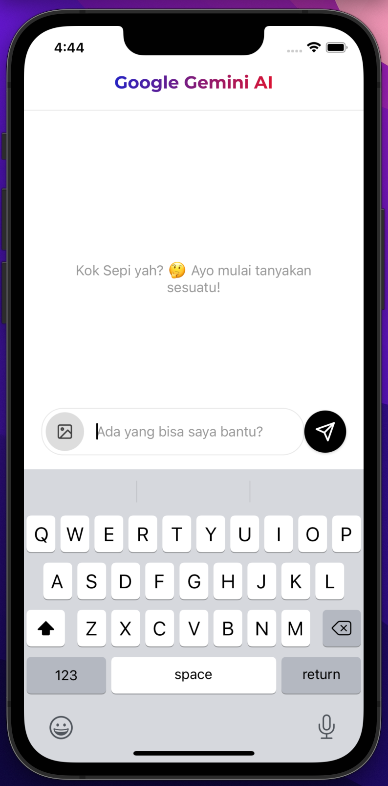

# React Native Chat AI using Gemini
create chat with google gemini AI

### Required:
* Node >18
* JDK 17
* Xcode 14.2

## Environment Variables

To run this project, you will need to add the following environment variables to your .env file on root project:


```bash
 GEMINI_AI_KEY=ENTER_YOUR_KEY
 ```

## Generate API Key
visit https://aistudio.google.com/app/apikey

## Screenshot


## Feedback

If you have any feedback, please reach out to xx us create issues

## Badges

[](https://choosealicense.com/licenses/mit/)
[](https://opensource.org/licenses/)
[](http://www.gnu.org/licenses/agpl-3.0)

## Support
[](https://buymeacoffee.com/unknown.dev)
